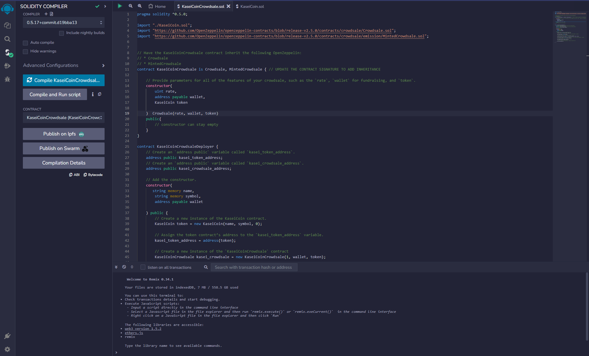

# Unit 21: Martian Token Crowdsale

# KaseiCoin
KaseiCoin is a new cryptocurrency that will be used by the first human colony on Mars. It’s based on blockchain technology and is ERC-20 compliant. KaseiCoin is minted by using a crowdsale contract from the OpenZeppelin Solidity library.

## Evaluation Evidence section

## Features
* KaseiCoin is a fungible token that follows the ERC-20 standard.
* KaseiCoin has a fixed supply of 100 million tokens.
* KaseiCoin has 18 decimals and uses the symbol KAI.
* KaseiCoin can be minted by sending ether to the crowdsale contract.
* The crowdsale contract has a rate of 1 KAI = 0.001 ether.
* The crowdsale contract has a wallet address that receives the ether from the buyers.
* The crowdsale contract has a cap of 300,000 ether that can be raised.
* The crowdsale contract has a time limit of 30 days.

# Installation
To install KaseiCoin, you’ll need the following tools:

* Remix IDE: An online IDE for developing smart contracts in Solidity.
* Ganache: A personal blockchain for Ethereum development.
* MetaMask: A browser extension that allows you to interact with Ethereum applications.
Follow these steps to install KaseiCoin:

1. Clone this repository or download the zip file.
2. Open Remix IDE and import the KaseiCoin.sol and KaseiCoinCrowdsale.sol files from the contracts folder.
3. Compile the contracts by using compiler version 0.5.0.
4. Open Ganache and create a new workspace with the default settings.
5. Open MetaMask and connect it to your local Ganache network.
6. In Remix IDE, switch to the Deploy tab and select the KaseiCoinDeployer contract from the dropdown menu.
7. Copy the first account address from Ganache and paste it in the Deployer constructor field as the wallet parameter.
8. Click Deploy and confirm the transaction in MetaMask.
9. After the deployment is successful, copy the token_address and token_sale_address from the Deployer contract.
10. In Remix IDE, select the KaseiCoin contract from the dropdown menu and enter the token_address in the At Address field. Click At Address to load the token contract instance.
11. In Remix IDE, select the KaseiCoinCrowdsale contract from the dropdown menu and enter the token_sale_address in the At Address field. Click At Address to load the crowdsale contract instance.